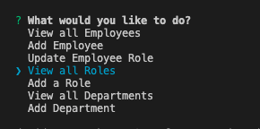
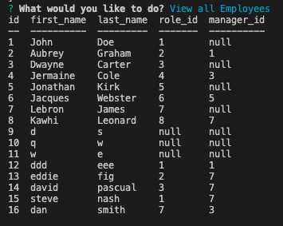

# Employee_Tracker

## Description
This application allows the user a add, update, view their employees, job roles, and departments from the database using inquirer prompts. 

## Installation
install proper dependancies by typing `npm i` in the terminal

## Usage
Once all dependances are installed, source the seed file and then source the schema file to have access to the data. 
Once complete, start the application by typing in `node index.js` in the terminal and the menu will be prompted to the user.

## Preview
[walkthrough Video](https://www.youtube.com/watch?v=MrFPPB40U6s)

## Author
- Github: davidpascual2
- Email: davidpascual200@gmail.com
